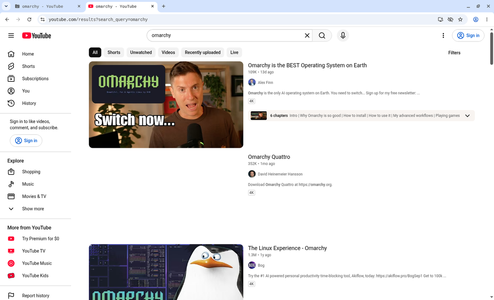

# foss-bot

An open-source take on Grok Bot's multi-agent team, built from skills, hooks, and config for the harnesses you already use: Claude Code and Codex CLI, directly or inside T3 Code. It adds no new app or runtime.

- **Chief of staff.** A coordinator skill that restates the ask, splits it into workstreams, sends each to a named bot, keeps a board, checks the evidence, and reports back.
- **A standing team.** Engineer, investigator, QA, reviewer, gardener, and scribe personas you can edit or add to.
- **Cross-model seats.** In Claude Code, every subagent is a Codex worker. In Codex, `claude-*` seats run through headless Claude Code.
- **Isolated computer use.** Bots drive browsers and desktops inside per-worker microVMs through the [cloud-computer-use-agents](https://github.com/dyl-joseph/cloud-computer-use-agents) engine, vendored at `engine/` as a submodule.
- **Subscription logins only.** Codex uses your ChatGPT login and Claude Code uses your claude.ai login. Nothing reads or sets an API key.

## Demo

A QA bot, running as a Codex worker on `gpt-6-luna`, opened YouTube in its own Agentbox VM and searched for "omarchy". It recorded the run and pulled the video back to the host (28 seconds).



[Watch the recording](assets/videos/agentbox-youtube-omarchy.mp4)

## How it fits together

| Piece | Where it installs | What it does |
| --- | --- | --- |
| `skills/chief-of-staff/` | `~/.agents/skills`, `~/.claude/skills` | The coordinator, the starter bot personas, and the board template. |
| `claude/hooks/codex-only-subagents.py` | `~/.claude/hooks` | A PreToolUse hook. It denies every subagent type except `codex:codex-rescue`, pins the Codex model and effort, and runs the forwarding wrapper on Haiku. |
| `claude/hooks/patch-codex-companion.py` | `~/.claude/hooks` | A SessionStart hook. It teaches the [`codex@openai-codex`](https://github.com/openai/codex-plugin-cc) plugin `--effort max` and `--fast`, and reapplies itself after plugin updates. |
| `codex/agent-roles/*.toml` | `~/.codex/agent-roles` | Codex `agent_type` roles that pin QA, gardener, and scribe to `gpt-6-luna` at max effort. |
| `codex/rules/agentbox.rules` | `~/.codex/rules` | Lets `agentbox` commands run outside the Codex sandbox, which cannot reach `/dev/kvm`. The commands themselves run inside the VM. |
| `pstack/harness.md` | `poteto-mode/references/` | Maps pstack's Cursor and Grok Bot primitives (`Task`, `readonly`, cloud agents, `/loop`, routines, Bugbot) to Claude Code and Codex. |
| `pstack/pstack-models.mdc` | `~/.agents/rules` | Per-role model choices for pstack. |
| `agents/AGENTS.foss-bot.md` | appended to `~/.agents/AGENTS.md` | The shared rules both harnesses load. |
| `engine/` | `~/.agents/skills`, `~/.local/bin/agentbox` | The `agentbox`, `computer-use`, and `record` skills and the Agentbox CLI. |

### Model policy

The model names are constants at the top of `claude/hooks/codex-only-subagents.py`. They must be models your ChatGPT plan can use.

| Work | Model |
| --- | --- |
| Default subagent | `gpt-6-sol`. The caller picks the effort with `--effort low\|medium\|high\|xhigh\|max`. |
| Really easy work (`--model gpt-6-luna`) | `gpt-6-luna`, max effort, fast mode |
| QA, gardener, scribe bots | `gpt-6-luna`, max effort, no fast mode, forced from the persona's `Bot:` line |
| `claude-*` seats (reviewer, judgment, prose) | The Claude Code main thread, or `claude -p --model claude-opus-5-5` from Codex |

## Install

Requirements:
- [Claude Code](https://docs.claude.com/en/docs/claude-code) and [Codex CLI](https://github.com/openai/codex), logged in with subscriptions.
- `python3` and `git`.
- For Agentbox: a KVM-capable Linux host with [Microsandbox](https://microsandbox.dev). See `engine/docs/agentbox.md`.

```sh
git clone --recurse-submodules https://github.com/dyl-joseph/foss-bot.git
cd foss-bot
python3 install.py --dry-run   # print every change
python3 install.py
```

The installer is safe to rerun:
- It links files from the repo, so a `git pull` updates the machine.
- It copies bot personas only when they are missing, so your edits win.
- It merges into `~/.claude/settings.json` and `~/.codex/config.toml` rather than replacing them.
- It moves anything it would replace to `~/.foss-bot-backup/`.

### pstack

foss-bot builds on [pstack](https://x.ai/bot/plugin/9717366), the skill pack from Lauren Tan's talks on running a team of coding bots. It does not include pstack. Install pstack into `~/.agents/skills` first, then run `install.py` again. The installer then adds the harness map and a one-line harness note to each pstack skill that dispatches work. Without pstack, the chief of staff and bots still work.

## Use

```text
/chief-of-staff fix the flaky login test and record the fixed flow   # Claude Code
$chief-of-staff fix the flaky login test and record the fixed flow   # Codex
```

The chief of staff never edits product code. Writer bots work in their own git worktrees, at most four at a time, and leave their changes uncommitted. The chief of staff commits after review. Each workspace's board lives at `~/.agents/cos/<slug>/board.md`. Say "standup" for status.

To give a bot its own desktop:

```sh
agentbox seed start        # sign into sites in the seed VM, then
agentbox seed stop
agentbox clone qa-1        # one VM per concurrent worker
```

Then name the VM ID in the bot's brief.

To add a bot, ask the chief of staff to "hire a bot", or write `~/.agents/bots/<role>.md` in the shape of the starter files.

## Test

```sh
python3 -m unittest discover tests
```

## License

MIT for this repo. The engine and pstack have their own terms.
